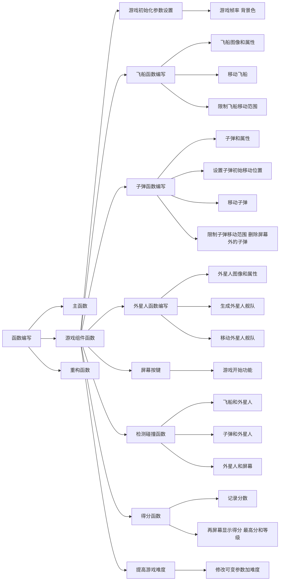
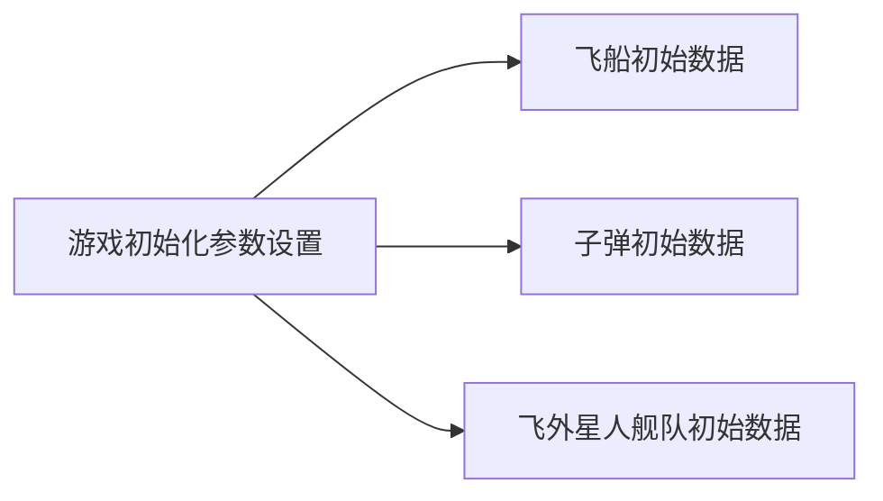
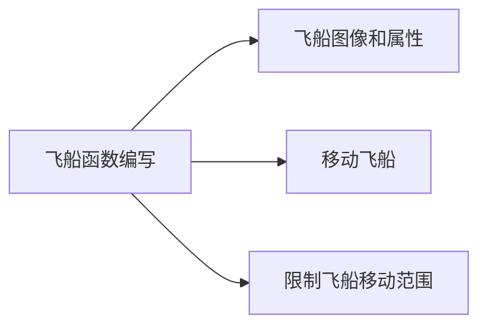
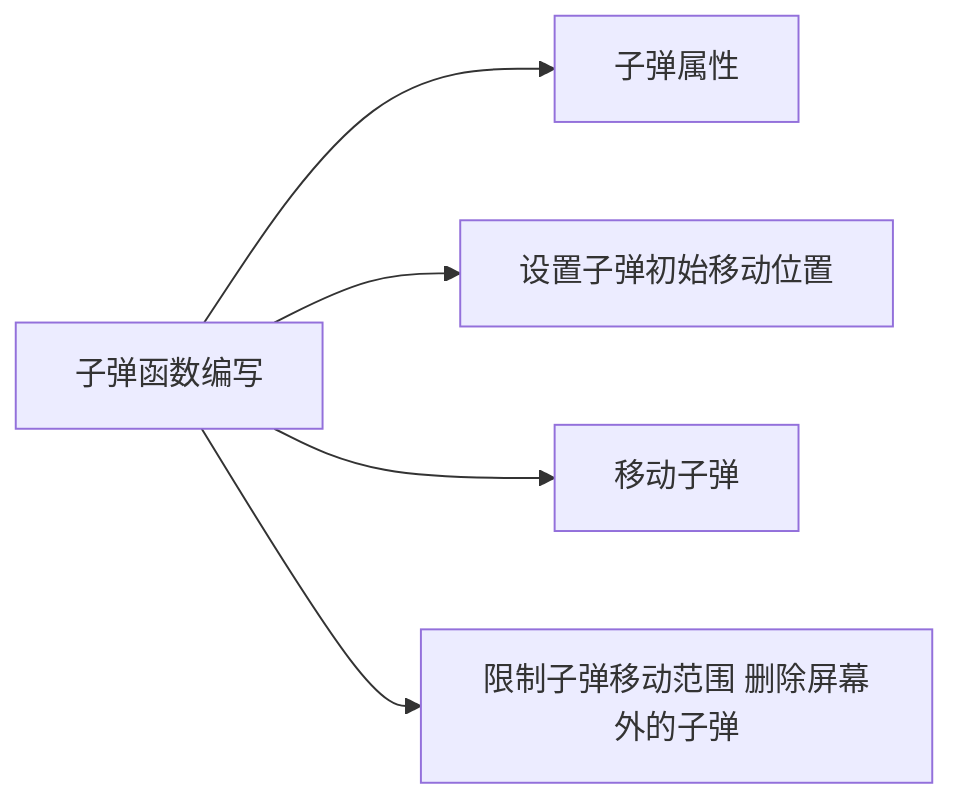
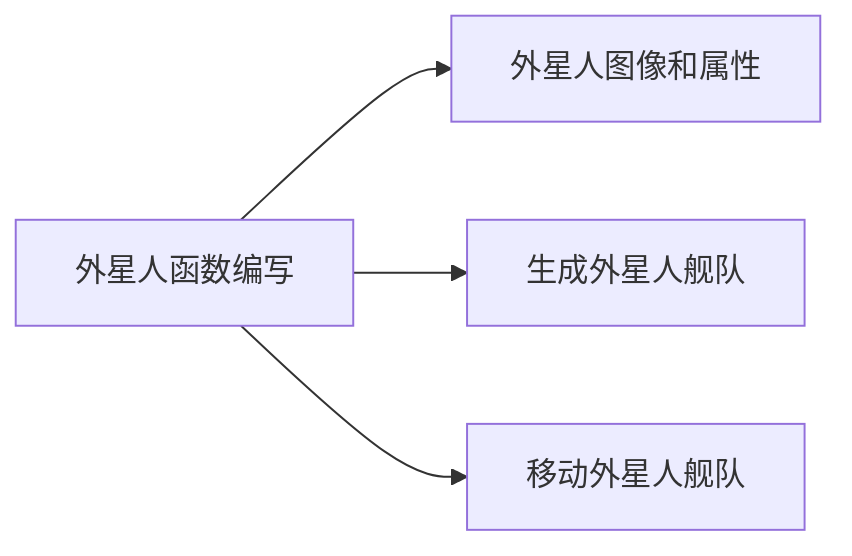
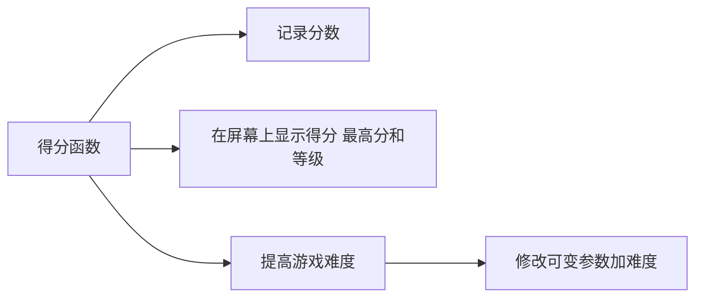
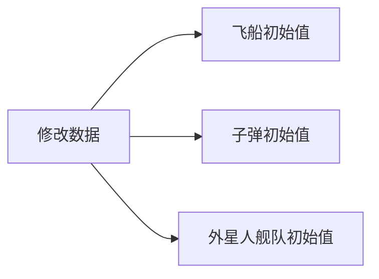

# 《Python程序设计基础》程序设计作品说明书

题目： 外星人入侵

学院： 21计科01

姓名： 张金京

学号： B20210302107

指导教师： 周景

起止日期：2023.11.10-2023.12.10

## 摘要

外星人入侵是一款玩家操纵飞船消灭外星人的游戏。《外星人入侵项
目，需要使用Pygame包来开发一款2D游戏，它在玩家没消灭一群向下移的
外星人后，都将玩家提高一个等级；而等级越高，游戏的节奏越快，难度
越大。而通过这个项目，我们需要具备Pygame的2D游戏所需的技能。我们
需要完成飞船的设计、外星人舰队设计、计分设计三个模块以及总模块来实现这款游戏的开发。

关键词：外星人入侵，Pygame、飞船设计、游戏开发

## 第1章 需求分析

开发外星人入侵游戏，软件环境是python，需要用到Pygame包来进行，并且也需要一定的Pygame的2D游戏所需的技能。开发这款游戏，需要游戏初始化模块、飞船模块、子弹模块、外星人舰队模块、按钮模块、计分模块、数据类模块等七个模块，让程序能够顺利完成客户的需求。

初始化模块：游戏每次开始都需要初始化游戏设置，除了最高分都恢复初始设置。

飞船模块：外星人入侵需要具备的模块，玩家可以控制飞船左右行驶来发射子弹，击毁外星人舰队。玩家拥有三次坠毁机会，被撞到或者外星人碰到屏幕底部飞船将会坠毁。

子弹模块：控制飞船发射的子弹，能够限制具体数量。

外星人舰队模块：外星人入侵需要具备的模块，外星人舰队会左右以及向下移动并且不会超出屏幕。

按钮模块：能够显示在屏幕上，点击后能触发多种功能。

计分模块:外星人入侵可以具备的模块：能够记录玩家最高得分以及控制游戏的难度。同时，该模块为游戏添加了大量的内容，可以大大优化玩家的游戏体验。

数据类模块：可以更改游戏的初始数据。

## 第2章 分析与设计

总体设计：为了实现外星人入侵，我们需要将飞船模块、外星人入侵模块、计分模块结合，在主函数中运行。下面是系统的一般架构：

1. 开始游戏项目：

需要创建表示游戏的类，以及新建Pygame窗口。控制游戏的帧率、设置背景色，初始化游戏的设置。导入飞船模块、外星人舰队模块、计分模块的类，让程序简单明了。最后再重构函数，让代码更加简单。



函数算法：

```python
import sys
from time import sleep

import pygame

from settings import Settings
from game_stats import GameStats
from scoreboard import Scoreboard
from button import Button
from ship import Ship
from bullet import Bullet
from alien import Alien

class AlienInvasion:
    """管理游戏资源和行为的类"""

    def __init__(self):
        """初始化游戏并创建游戏资源"""
        pygame.init()
        self.clock = pygame.time.Clock()
        self.settings = Settings()

        self.screen = pygame.display.set_mode(
            (self.settings.screen_width, self.settings.screen_height))
        pygame.display.set_caption("Alien Invasion")
        
        #创建存储游戏统计信息的实例，并创建计分牌
        self.stats = GameStats(self)
        self.sb = Scoreboard(self)

        self.ship = Ship(self)
        self.bullets = pygame.sprite.Group()
        self.aliens = pygame.sprite.Group()

        self._create_fleet()
        
        #游戏启动后处于活动状态
        self.game_active = False
        
        #创建Play按钮
        self.play_button = Button(self, "Play")

        def run_game(self):
        """Start the main loop for the game."""
        while True:
            self._check_events()
            
            if self.game_active:
                self.ship.update()
                self._update_bullets()
                self._update_aliens()
                
            self._update_screen()
            self.clock.tick(60)

            #删除已消失的子弹
            for bullet in self.bullets.copy():
                if bullet.rect.bottom<=0:
                    self.bullets.remove(bullet)
            
    def _update_screen(self):
        """更新屏幕上的图像并切换到新屏幕"""
        self.screen.fill(self.settings.bg_color)
        for bullet in self.bullets.sprites():
            bullet.draw_bullet()
        self.ship.blitme()
        self.aliens.draw(self.screen)
        
        #显示得分
        self.sb.show_score()
        
        #如果游戏处于非活动状态，就绘制Play按钮
        if not self.game_active:
            self.play_button.draw_button()

        pygame.display.flip()
            
    def _check_events(self):
        """响应键盘和鼠标事件"""
        for event in pygame.event.get():
            if event.type == pygame.QUIT:
                sys.exit()
            elif event.type == pygame.KEYDOWN:
                self._check_keydown_events(event)
            elif event.type == pygame.KEYUP:
                self._check_keyup_events(event)
            elif event.type == pygame.MOUSEBUTTONDOWN:
                mouse_pos = pygame.mouse.get_pos()
                self._check_play_button(mouse_pos)
    
    def _check_play_button(self, mouse_pos):
        """在玩家单机play按钮时开始新游戏"""
        button_clicked=self.play_button.rect.collidepoint(mouse_pos)
        if button_clicked and not self.game_active:
            #还原游戏设置
            self.settings.initialize_dynamic_settings()
            
            #重置游戏的统计信息
            self.stats.reset_stats()
            self.sb.prep_score()
            self.sb.prep_level()
            self.sb.prep_ships()
            self.game_active = True
            
            #清空外星人列表和子弹列表
            self.bullets.empty()
            self.aliens.empty()
            
            #创建一个新的外星舰队，并将飞船放在屏幕底部的中央
            self._create_fleet()
            self.ship.center_ship()
            
            #隐藏光标
            pygame.mouse.set_visible(False)

    def _check_keydown_events(self, event):
        """响应按下"""
        if event.key == pygame.K_RIGHT:
            self.ship.moving_right = True
        elif event.key == pygame.K_LEFT:
            self.ship.moving_left = True
        elif event.key == pygame.K_q:
            sys.exit()
        elif event.key == pygame.K_SPACE:
            self._fire_bullet()          

    def _check_keyup_events(self, event):
        """响应释放"""
        if event.key == pygame.K_RIGHT:
            self.ship.moving_right = False
        elif event.key == pygame.K_LEFT:
            self.ship.moving_left = False

    def _fire_bullet(self):
        """创建一颗子弹，并将其加入编组bullets"""
        if len(self.bullets) < self.settings.bullets_allowed:
            new_bullet = Bullet(self)
            self.bullets.add(new_bullet)

    def _update_bullets(self):
        """更新子弹的位置,并删除已消失的子弹"""
        #更新子弹位置
        self.bullets.update()

        #删除已消失的子弹
        for bullet in self.bullets.copy():
            if bullet.rect.bottom <= 0:
                self.bullets.remove(bullet)

        self._check_bullet_alien_collisions()
        

    def _check_bullet_alien_collisions(self):
        """响应子弹和外星人的碰撞"""
        #删除发生碰撞的子弹和外星人
        collisions = pygame.sprite.groupcollide(
                self.bullets, self.aliens, True, True)
        
        if collisions:
            for aliens in collisions.values():
                self.stats.score += self.settings.alien_points * len(aliens)
            self.sb.prep_score()
            self.sb.check_high_score()

        if not self.aliens:
            #删除现有的所有子弹，并创建一个新的外星舰队
            self.bullets.empty()
            self._create_fleet()
            self.settings.increase_speed()
            
            #提高等级
            self.stats.level +=1
            self.sb.prep_level()

    def _ship_hit(self):
        """响应飞船和外星人的碰撞"""
        if self.stats.ships_left > 0:
            #将ship_left减1并更新计分牌
            self.stats.ships_left -= 1
            self.sb.prep_ships()

            #清空外星人列表和子弹列表
            self.bullets.empty()
            self.aliens.empty()

            #创建一个新的外星舰队，并将·飞船放在屏幕底部的中央
            self._create_fleet()
            self.ship.center_ship()

            #暂停
            sleep(0.5)
        else:
            self.game_active = False
            pygame.mouse.set_visible(True)
            
    def _update_aliens(self):
        """检查是否有外星人位于屏幕边缘，并更新整个外星舰队的位置"""
        self._check_fleet_edges()
        self.aliens.update()
        
        #检测外星人和飞船之间的碰撞
        if pygame.sprite.spritecollideany(self.ship, self.aliens):
            self._ship_hit()
            
        #检查是否有外星人到达了屏幕的下边缘
        self._check_aliens_bottom()
        
    def _check_aliens_bottom(self):
        """检查是否有外星人到达了屏幕的下边缘"""
        for alien in self.aliens.sprites():
            if alien.rect.bottom >= self.settings.screen_height:
                #像飞船被撞到一样的处理
                self._ship_hit()
                break

    def _create_fleet(self):
        """创建一个外星人舰队"""
        #创建一个外星人，并不断添加，直到没有空间添加外星人为止
        #创建外星人的间距为外星人的宽度
        #外星人的间距为外星人的宽度和外星人的高度
        alien = Alien(self)
        alien_width, alien_height = alien.rect.size

        current_x, current_y = alien_width, alien_height
        while current_y < (self.settings.screen_height - 3 * alien_height):
            while current_x < (self.settings.screen_width - 2 * alien_width):
                self._create_alien(current_x, current_y)
                current_x += 2 * alien_width

            #添加一行外星人后，重置x值并递增y值
            current_x = alien_width
            current_y += 2 * alien_height

    def _create_alien(self, x_position, y_position):
        """创建一个外星人并将其加入外星舰队"""
        new_alien = Alien(self)
        new_alien.x = x_position
        new_alien.rect.x = x_position
        new_alien.rect.y = y_position
        self.aliens.add(new_alien)

    def _check_fleet_edges(self):
        """在有外星人达到边缘时采取相应的措施"""
        for alien in self.aliens.sprites():
            if alien.check_edges():
                self._change_fleet_direction()
                break

    def _change_fleet_direction(self):
        """将整个外星舰队向下移动，并改变他们的方向"""
        for alien in self.aliens.sprites():
            alien.rect.y += self.settings.fleet_drop_speed
        self.settings.fleet_direction *= -1

if __name__ == '__main__':
    #创建游戏实例并运行游戏
    ai = AlienInvasion()
    ai.run_game()
```

2. 初始化模块：

游戏每次开始都需要初始化游戏设置，除了最高分都恢复初始设置。



```python
class GameStats:
    """跟踪游戏的统计信息"""

    def __init__(self, ai_game):
        """初始化信息"""
        self.settings = ai_game.settings
        self.reset_stats()
        
        
        #在任何情况下都不应该重置最高分
        self.high_score = 0

    def reset_stats(self):
        """初始化在游戏运行期间可能变化的统计信息"""
        self.ships_left = self.settings.ship_limit
        self.score = 0
        self.level = 1
```

3. 飞船模块：

添加飞船图像，然后开始创建飞船的类。首先添加飞船图像，载入飞船属性，飞船能够左右移动并且有范围限制。



```python
class Alien(Sprite):
    """表示单个外星人的类"""

    def __init__(self,ai_game):
        """初始化外星人并设置其初始位置"""
        super().__init__()
        self.screen=ai_game.screen
        self.settings=ai_game.settings

        #加载外星人图像并设置其rect属性
        self.image=pygame.image.load('images/alien.bmp')
        self.rect=self.image.get_rect()

        #每个外星人最初都在屏幕左上角附件
        self.rect.x=self.rect.width
        self.rect.y=self.rect.height

        #存储外星人的精确水平位置
        self.x=float(self.rect.x)

    def check_edges(self):
        """如果外星人位于屏幕边缘，就返回True"""
        screen_rect = self.screen.get_rect()
        return (self.rect.right >= screen_rect.right) or (self.rect.left <= 0)

    def update(self):
        """向右移动外星人"""
        self.x += self.settings.alien_speed * self.settings.fleet_direction
        self.rect.x = self.x
```

4. 子弹模块：

创建子弹的类。载入子弹的属性，设置子弹的初始位置在飞船前以及子弹的移动方向，最后限制子弹的范围，不能超出屏幕。



```python
import pygame
from pygame.sprite import Sprite

class Bullet(Sprite):
    """管理飞船所发射子弹的类"""
    
    def __init__(self,ai_game):
        """在飞船的当前位置创建一个子弹对象"""
        super().__init__()
        self.screen = ai_game.screen
        self.settings = ai_game.settings
        self.color = self.settings.bullet_color
        
        #在(0,0)处创建一个表示子弹的矩形，再设置正确的位置
        self.rect = pygame.Rect(0,0,self.settings.bullet_width,
            self.settings.bullet_height)
        self.rect.midtop = ai_game.ship.rect.midtop
        
        #存储用浮点数表示的子弹位置
        self.y=float(self.rect.y)
        
    def update(self):
        """向上移动子弹"""
        #更新子弹的准确位置
        self.y-= self.settings.bullet_speed
        #更新表示子弹的rect的位置
        self.rect.y=self.y
        
    def draw_bullet(self):
        """在屏幕上绘制子弹"""
        pygame.draw.rect(self.screen,self.color,self.rect)
```

5. 外星人舰队模块

创建外星人的类。首先添加外星人的图像，然后载入外星人的属性。再生成外星人的舰队，



```python
import pygame

from pygame.sprite import Sprite


class Alien(Sprite):
    """表示单个外星人的类"""

    def __init__(self,ai_game):
        """初始化外星人并设置其初始位置"""
        super().__init__()
        self.screen=ai_game.screen
        self.settings=ai_game.settings

        #加载外星人图像并设置其rect属性
        self.image=pygame.image.load('images/alien.bmp')
        self.rect=self.image.get_rect()

        #每个外星人最初都在屏幕左上角附件
        self.rect.x=self.rect.width
        self.rect.y=self.rect.height

        #存储外星人的精确水平位置
        self.x=float(self.rect.x)

    def check_edges(self):
        """如果外星人位于屏幕边缘，就返回True"""
        screen_rect = self.screen.get_rect()
        return (self.rect.right >= screen_rect.right) or (self.rect.left <= 0)

    def update(self):
        """向右移动外星人"""
        self.x += self.settings.alien_speed * self.settings.fleet_direction
        self.rect.x = self.x
```

6. 按钮模块：

创建按钮的类。在屏幕上显示“游戏开始”，鼠标点击后开始游戏。


```python
import pygame.font


class Button:
    """为游戏创建按钮的类"""

    def __init__(self, ai_game, msg):
        """初始化按钮的属性"""
        self.screen = ai_game.screen
        self.screen_rect = self.screen.get_rect()

        #设置按钮的尺寸和其他属性
        self.width, self.height = 200, 50
        self.button_color = (0, 135, 0)
        self.text_color = (255, 255, 255)
        self.font = pygame.font.SysFont(None, 48)

        #创建按钮的rect对象，并使其居中
        self.rect = pygame.Rect(0, 0, self.width, self.height)
        self.rect.center = self.screen_rect.center

        # 按钮的标签只需创建一次
        self._prep_msg(msg)

    def _prep_msg(self, msg):
        """将msg渲染为图像，并使其在按钮上居中"""
        self.msg_image = self.font.render(msg, True, self.text_color,
                self.button_color)
        self.msg_image_rect = self.msg_image.get_rect()
        self.msg_image_rect.center = self.rect.center

    def draw_button(self):
        """绘制一个用颜色填充的按钮，再绘制文本"""
        self.screen.fill(self.button_color, self.rect)
        self.screen.blit(self.msg_image, self.msg_image_rect)
```

7. 计分模块：

创建计分的类。能够记录分数，在屏幕上显示得分、最高分和难度等级。
还能够根据游戏进行提高难度参数。



```python
import pygame.font
from pygame.sprite import Group

from ship import Ship


class Scoreboard:
    """显示得分信息的类"""

    def __init__(self, ai_game):
        """初始化显示得分涉及的属性"""
        self.ai_game = ai_game
        self.screen = ai_game.screen
        self.screen_rect = self.screen.get_rect()
        self.settings = ai_game.settings
        self.stats = ai_game.stats

        #显示得分信息时使用的字体设置
        self.text_color = (30, 30, 30)
        self.font = pygame.font.SysFont(None, 48)

        #准备包含最高分和当前得分的图像
        self.prep_score()
        self.prep_high_score()
        self.prep_level()
        self.prep_ships()

    def prep_score(self):
        """将得分渲染为图像"""
        rounded_score = round(self.stats.score, -1)
        score_str = f"{rounded_score:,}"
        self.score_image = self.font.render(score_str, True,
                self.text_color, self.settings.bg_color)

        #将最高分放在屏幕顶端的中央
        self.score_rect = self.score_image.get_rect()
        self.score_rect.right = self.screen_rect.right - 20
        self.score_rect.top = 20

    def prep_high_score(self):
        """将最高分渲染为图像"""
        high_score = round(self.stats.high_score, -1)
        high_score_str = f"{high_score:,}"
        self.high_score_image = self.font.render(high_score_str, True,
                self.text_color, self.settings.bg_color)
        
        #将最高分放在屏幕顶端的中央
        self.high_score_rect = self.high_score_image.get_rect()
        self.high_score_rect.centerx = self.screen_rect.centerx
        self.high_score_rect.top = self.score_rect.top

    def prep_level(self):
        """将等级渲染为图像"""
        level_str = str(self.stats.level)
        self.level_image = self.font.render(level_str, True,
                self.text_color, self.settings.bg_color)

        #将等级放在得分下方
        self.level_rect = self.level_image.get_rect()
        self.level_rect.right = self.score_rect.right
        self.level_rect.top = self.score_rect.bottom + 10

    def prep_ships(self):
        """显示余下多少搜飞船"""
        self.ships = Group()
        for ship_number in range(self.stats.ships_left):
            ship = Ship(self.ai_game)
            ship.rect.x = 10 + ship_number * ship.rect.width
            ship.rect.y = 10
            self.ships.add(ship)

    def check_high_score(self):
        """检查是否诞生了最高分"""
        if self.stats.score > self.stats.high_score:
            self.stats.high_score = self.stats.score
            self.prep_high_score()

    def show_score(self):
        """在屏幕上绘制得分、等级和余下的飞船数"""
        self.screen.blit(self.score_image, self.score_rect)
        self.screen.blit(self.high_score_image, self.high_score_rect)
        self.screen.blit(self.level_image, self.level_rect)
        self.ships.draw(self.screen)
```

8. 数据类模块：

创建数据的类。能够存储所有的类，修改初始值。



```python
class Settings:
    """存储游戏《外星人入侵》中所有设置的类"""

    def __init__(self):
        """初始化游戏的静态设置"""
        #屏幕设置
        self.screen_width = 1200
        self.screen_height = 800
        self.bg_color = (230, 230, 230)
        
        #飞船的设置
        self.ship_limit = 3
        
        #子弹设置
        self.bullet_width = 3
        self.bullet_height = 15
        self.bullet_color = (60, 60, 60)
        self.bullets_allowed = 5
        
        #外星人设置
        self.fleet_drop_speed = 10
        
        #以什么速度加快游戏的节奏
        self.speedup_scale = 1.1
        #外星人分数提高速度
        self.score_scale = 1.5
        
        self.initialize_dynamic_settings()
        
    def initialize_dynamic_settings(self):
        """初始化随着游戏进行而变化的设置"""
        self.ship_speed = 1.5
        self.bullet_speed = 2.5
        self.alien_speed = 1.0
            
        #fleet_direction为1表示向右，为-1表示向左
        self.fleet_direction = 1
        
        #计分设置
        self.alien_points = 1
            
    def increase_speed(self):
        """提高速度设置的值合外星人的分数"""
        self.ship_speed *= self.speedup_scale
        self.bullet_speed *= self.speedup_scale
        self.alien_speed *= self.speedup_scale

        self.alien_points = int(self.alien_points * self.score_scale)
```

## 第3章 软件测试

子弹测试

```python
def _update_bullets(self):
        """更新子弹的位置,并删除已消失的子弹"""
        #更新子弹位置
        self.bullets.update()

        #删除已消失的子弹
        for bullet in self.bullets.copy():
            if bullet.rect.bottom <= 0:
                self.bullets.remove(bullet)

        self._check_bullet_alien_collisions()
```

按键测试

```python
def _check_events(self):
    """响应键盘和鼠标事件"""
    for event in pygame.event.get():
        if event.type == pygame.QUIT:
                sys.exit()
        elif event.type == pygame.KEYDOWN:
                self._check_keydown_events(event)
        elif event.type == pygame.KEYUP:
                self._check_keyup_events(event)
        elif event.type == pygame.MOUSEBUTTONDOWN:
                mouse_pos = pygame.mouse.get_pos()
                self._check_play_button(mouse_pos)
```

子弹与外星人的碰撞

```python
def _check_bullet_alien_collisions(self):
        """响应子弹和外星人的碰撞"""
        #删除发生碰撞的子弹和外星人
        collisions = pygame.sprite.groupcollide(
                self.bullets, self.aliens, True, True)
        
        if collisions:
            for aliens in collisions.values():
                self.stats.score += self.settings.alien_points * len(aliens)
            self.sb.prep_score()
            self.sb.check_high_score()

        if not self.aliens:
            #删除现有的所有子弹，并创建一个新的外星舰队
            self.bullets.empty()
            self._create_fleet()
            self.settings.increase_speed()
            
            #提高等级
            self.stats.level +=1
            self.sb.prep_level()
```

飞船和外星人的碰撞

```python
def _ship_hit(self):
        """响应飞船和外星人的碰撞"""
        if self.stats.ships_left > 0:
            #将ship_left减1并更新计分牌
            self.stats.ships_left -= 1
            self.sb.prep_ships()

            #清空外星人列表和子弹列表
            self.bullets.empty()
            self.aliens.empty()

            #创建一个新的外星舰队，并将飞船放在屏幕底部的中央
            self._create_fleet()
            self.ship.center_ship()

            #暂停
            sleep(0.5)
        else:
            self.game_active = False
            pygame.mouse.set_visible(True)
```

### 单元测试用例

| \#  | 测试目标 | 输入 | 预期结果 | 测试结果 |
| --- | --------- | ----- | ---------------- | ----------------- |
| 1   | 发出子弹，子删除超出屏幕的子弹          | 发射子弹    | 子弹超出屏幕后，子弹消失                 | 子弹成功消失                  |
| 2   | 按下Q是否能退出游戏          | 按下Q      | 退出游戏                 | 成功退出游戏                  |
| 3   |子弹碰到外星人，子弹和外星人同时消失           |发射子弹       | 子弹碰到外星人时同时消失                 |                   |
| 4   | 飞船与外星人碰撞，飞船被击毁          | 飞船被外星人撞到      |  飞船被外星人撞到，飞船数减少1                | 飞船数减少1                  |

## 结论

外星人入侵的游戏开发成功达到了预期的期望。飞船拥有额外三个机体，碰撞到外星人坠毁后能够重新开始游戏；能够左右移动并发射子弹。拥有分数显示和提高难度的功能，每级提升难度不大，玩家能够拥有良好的体验。

## 参考文献

李陈（2017）。基于Python的外星人入侵游戏的设计与实现。2017年第二届计算机科学与技术国际会议，1-5。

王昭 (2018). 使用Python和Pygame开发外星人入侵游戏. 计算机与通信系统国际会议论文集, 1-5。

Zelle, J. M. (2010). Python编程：计算机科学导论. Franklin, Beedle & Associates。
